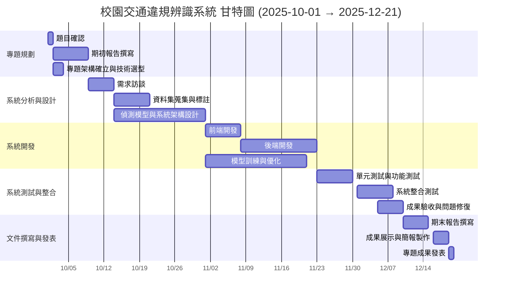
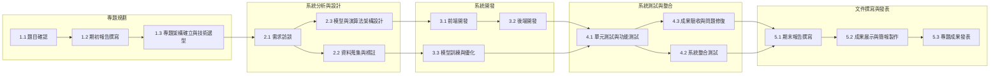

# 校園交通違規辨識系統
11401_系統分析與設計_課程 專題
**第六組**
* **吳冠廷(組長)**
* 莊郡緯
* 邱柏勛
* 洪偉棋

專題規劃開始時間：10/1 結束時間：12/21

```mermaid
gantt
    title 校園交通違規辨識系統 甘特圖 (2025-10-01 → 2025-12-21)
    dateFormat  YYYY-MM-DD
    axisFormat %m/%d

    section 專題規劃
    題目確認            :A1, 2025-10-01, 1d
    期初報告撰寫 :A2, 2025-10-02, 7d
    專題架構確立與技術選型   :A3, 2025-10-02, 2d

    section 系統分析與設計
    需求訪談 :B1, 2025-10-09, 5d
    資料集蒐集與標註             :B2, 2025-10-14, 7d
    偵測模型與系統架構設計          :B3, 2025-10-14, 18d

    section 系統開發
    前端開發   :C1, 2025-11-01, 7d
    後端開發   :C2, 2025-11-08, 15d
    模型訓練與優化       :C3, 2025-11-01, 20d

    section 系統測試與整合
    單元測試與功能測試         :D1, 2025-11-23, 7d
    系統整合測試              :D2, 2025-12-01, 7d
    成果驗收與問題修復        :D3, 2025-12-05, 5d

    section 文件撰寫與發表
    期末報告撰寫        :E1, 2025-12-10, 5d
    成果展示與簡報製作              :E2, 2025-12-16, 3d
    專題成果發表     :E3, 2025-12-19, 1d
```

```mermaid
graph LR

subgraph "專題規劃"
    B[1.1 題目確認] --> C[1.2 期初報告撰寫];
    C --> D[1.3 專題架構確立與技術選型];
end
subgraph "系統分析與設計"
    D --> E[2.1 需求訪談];
    E --> F[2.2 資料蒐集與標註];
    E --> G[2.3 模型與演算法架構設計];
end
subgraph "系統開發"
    G --> H[3.1 前端開發];
    H --> I[3.2 後端開發];
    F --> J[3.3 模型訓練與優化];
end
subgraph "系統測試與整合"
    I --> K[4.1 單元測試與功能測試];
    J --> K;
    K --> L[4.2 系統整合測試];
    K --> M[4.3 成果驗收與問題修復];
end
subgraph "文件撰寫與發表"
    M --> N[5.1 期末報告撰寫];
    L --> N;
    N --> O[5.2 成果展示與簡報製作];
    O --> P[5.3 專題成果發表];
end
```

