# 校園交通違規辨識系統
11401_系統分析與設計_課程 專題

**第六組**

| 學號 | 姓名 | 分工 |
| :---: | :---: | :---: |
| C112118116 | 吳冠廷 | 組長、訓練模型、後端開發 |
| C112118149 | 莊郡緯 | 訓練模型、前端開發、後端開發 |
| C112118135 | 邱柏勛 | 文獻探討、處理影像 |
| C112118118 | 洪偉棋 | 處理影像、報告撰寫 |

-----
### 技術架構
```
語言：Python 3.10+
AI 模型：YOLOv8
網頁框架：Streamlit (Multi-page App 架構)
影像處理：OpenCV (cv2)
資料儲存：
  - 違規紀錄：CSV 檔案 (violation_log.csv)
  - 系統設定：JSON 檔案 (settings.json)
  - 違規照片：本機資料夾 (violation_snapshots/)
```
-----

### 目前的專案結構
```text
YOLOv8_Project/
├── app.py                   # 系統入口 (登入頁面)
├── utils.py                 # 核心模組 (AI載入、DB讀寫、樣式渲染)
├── settings.json            # 系統設定檔 (門檻值、攝影機IP)
├── violation_log.csv        # 違規紀錄資料庫 (CSV)
├── assets/                  # 靜態資源
│   └── nkust_logo.png       # 學校 Logo
├── pages/                   # 功能頁面
│   ├── 1_📹_即時監控.py
│   ├── 2_🕒_歷史紀錄.py
│   ├── 3_📊_報表匯出.py
│   └── 4_⚙️_系統設定.py
├── violation_snapshots/     # 違規照片存檔 (自動管理容量)
│   ├── violation_20251130_1.jpg
│   └── ...
└── runs/                    # 模型相關路徑
    └── detect/
        └── my_kaggle_test_run2/
            └── weights/
                └── best.pt  # YOLOv8 權重檔
```
-----
### 研究摘要
在現代大學校園中，機車是學生主要的交通工具之一，然而，部分騎士會因貪圖方便而未佩戴安
全帽，此舉不僅違反交通法規，更對個人安全構成嚴重威脅。我們發現從宿舍往教學大樓的路上
，機車騎士未戴安全帽的違規行為頻繁發生，這不僅增加了校園內發生事故時的傷害風險，也反
映出當前管理措施的局限性。 

傳統的校園違規取締多依賴人力巡視，不僅耗費大量人力與時間，也難以做到全時段、無死角的
監控。因此，開發一個自動化、高效能的偵測系統，以科技手段輔助校園交通安全管理，顯得刻不
容緩。本專題即是針對此一痛點，利用最新的深度學習技術，建構一套智慧型的機車騎士安全帽
偵測系統，以具體行動回應「如何利用科技提升校園安全管理效率」的核心問題。 

-----

專題規劃開始時間：10/1 結束時間：12/21

```mermaid
gantt
    title 校園交通違規辨識系統 甘特圖 (2025-10-01 → 2025-12-21)
    dateFormat  YYYY-MM-DD
    axisFormat %m/%d

    section 專題規劃
    題目確認            :A1, 2025-10-01, 1d
    期初報告撰寫 :A2, 2025-10-02, 7d
    專題架構確立與技術選型   :A3, 2025-10-02, 2d

    section 系統分析與設計
    需求訪談 :B1, 2025-10-09, 5d
    資料集蒐集與標註             :B2, 2025-10-14, 7d
    偵測模型與系統架構設計          :B3, 2025-10-14, 18d

    section 系統開發
    前端開發   :C1, 2025-11-01, 7d
    後端開發   :C2, 2025-11-08, 15d
    模型訓練與優化       :C3, 2025-11-01, 20d

    section 系統測試與整合
    單元測試與功能測試         :D1, 2025-11-23, 7d
    系統整合測試              :D2, 2025-12-01, 7d
    成果驗收與問題修復        :D3, 2025-12-05, 5d

    section 文件撰寫與發表
    期末報告撰寫        :E1, 2025-12-10, 5d
    成果展示與簡報製作              :E2, 2025-12-16, 3d
    專題成果發表     :E3, 2025-12-19, 1d
```

```mermaid
graph LR

subgraph "專題規劃"
    B[1.1 題目確認] --> C[1.2 期初報告撰寫];
    C --> D[1.3 專題架構確立與技術選型];
end
subgraph "系統分析與設計"
    D --> E[2.1 需求訪談];
    E --> F[2.2 資料蒐集與標註];
    E --> G[2.3 模型與演算法架構設計];
end
subgraph "系統開發"
    G --> H[3.1 前端開發];
    H --> I[3.2 後端開發];
    F --> J[3.3 模型訓練與優化];
end
subgraph "系統測試與整合"
    I --> K[4.1 單元測試與功能測試];
    J --> K;
    K --> L[4.2 系統整合測試];
    K --> M[4.3 成果驗收與問題修復];
end
subgraph "文件撰寫與發表"
    M --> N[5.1 期末報告撰寫];
    L --> N;
    N --> O[5.2 成果展示與簡報製作];
    O --> P[5.3 專題成果發表];
end
```







