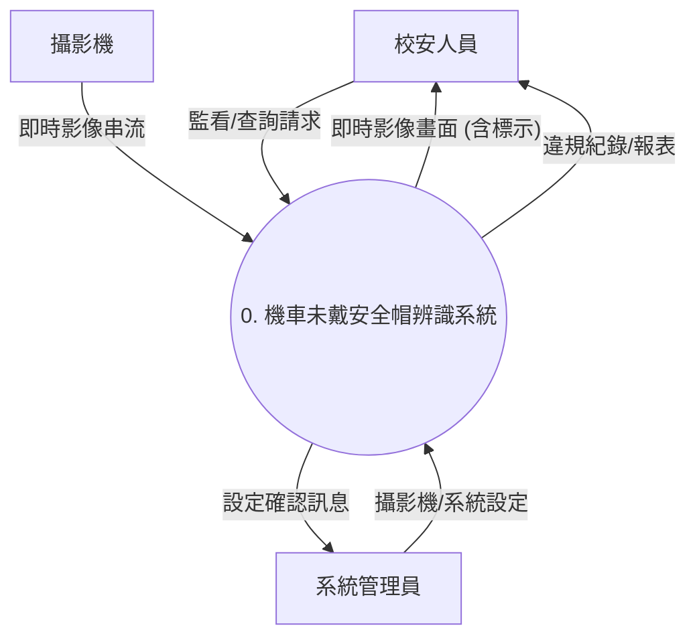
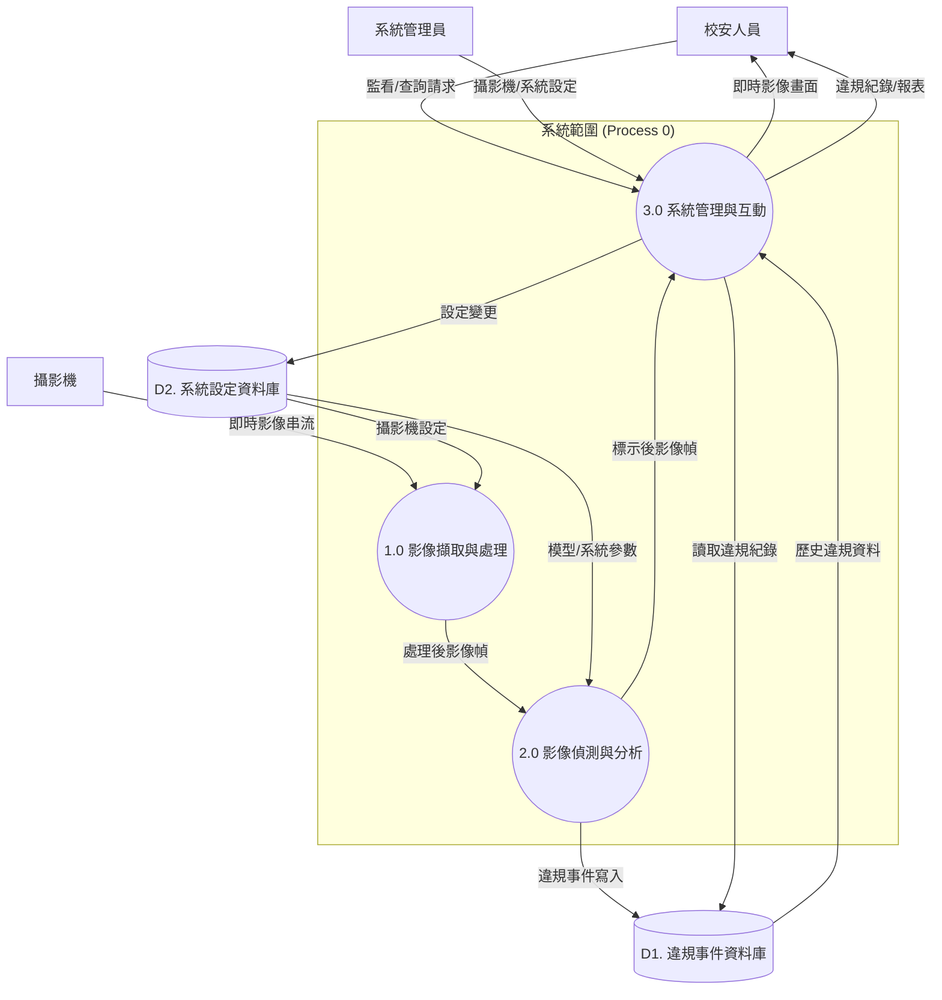

## 系統環境圖 (DFD)

### DFD Context Diagram

```mermaid

graph TD
    %% 外部實體 (External Entities) - 使用矩形
    E1["校安人員"]
    E2["系統管理員"]
    E3["攝影機"]

    %% 系統核心程序 (Process 0) - 使用圓角矩形
    P0((0. 機車未戴安全帽辨識系統))

    %% 資料流 (Data Flows)
    E3 -- "即時影像串流" --> P0
    
    E1 -- "監看/查詢請求" --> P0
    P0 -- "即時影像畫面 (含標示)" --> E1
    P0 -- "違規紀錄/報表" --> E1
    
    E2 -- "攝影機/系統設定" --> P0
    P0 -- "設定確認訊息" --> E2

```

### Level 0 Diagram

```mermaid

graph TD
    %% 外部實體 (External Entities)
    E1["校安人員"]
    E2["系統管理員"]
    E3["攝影機"]

    %% 資料儲存庫 (Data Stores) - 使用[(...)]表示開放式矩形
    D1[("D1. 違規事件資料庫")]
    D2[("D2. 系統設定資料庫")]

    %% 子程序 (Processes) - 至少三項
    subgraph "系統範圍 (Process 0)"
        P1((1.0 影像擷取與處理))
        P2((2.0 影像偵測與分析))
        P3((3.0 系統管理與互動))
    end

    %% --- 資料流 (Data Flows) ---

    %% 外部 -> 程序
    E3 -- "即時影像串流" --> P1
    E1 -- "監看/查詢請求" --> P3
    E2 -- "攝影機/系統設定" --> P3

    %% 程序 <-> 程序
    P1 -- "處理後影像幀" --> P2
    P2 -- "標示後影像幀" --> P3

    %% 程序 -> 外部
    P3 -- "即時影像畫面" --> E1
    P3 -- "違規紀錄/報表" --> E1
    %% 移除了流向 E4 的告警訊號

    %% 程序 <-> 資料儲存庫
    P2 -- "違規事件寫入" --> D1
    P3 -- "讀取違規紀錄" --> D1
    D1 -- "歷史違規資料" --> P3

    P3 -- "設定變更" --> D2
    D2 -- "攝影機設定" --> P1
    D2 -- "模型/系統參數" --> P2

```
