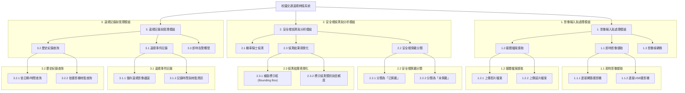
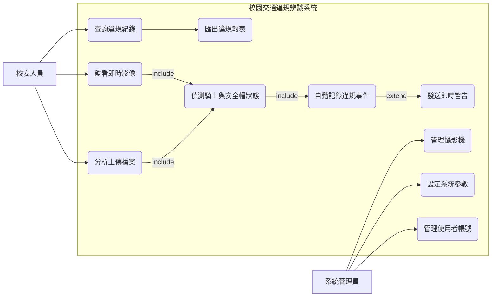

# 專題系統需求分析:校園交通違規辨識系統

## 功能性需求 (Functional Requirements)

### 1.影像來源擷取與處理功能 (Video/Image Input and Processing)
- 系統應能夠接收即時影像串流：可以連接網路攝影機（IP Camera）或USB攝影機，即時擷取校園車道或停車場的畫面。
- 系統應支援上傳影片或圖片檔案：使用者可以手動上傳預先錄製好的影片（例如.mp4, .avi格式）或單張圖片（.jpg, .png格式），系統會對這些檔案進行分析。
- 系統應能將影片自動轉換為連續影像幀：為了進行物件偵測，系統需要能設定固定的時間間隔（例如每秒擷取5幀）或自動將影片逐幀分解，以利YOLOv8模型進行後續辨識。

### 2.安全帽佩戴偵測與標示功能 (Helmet Detection and Labeling)
- 系統必須能準確辨識畫面中的機車騎士：利用YOLOv8模型，框選出影像中所有騎乘機車的人物。
- 系統必須能判斷騎士是否佩戴安全帽：對於每一個辨識出的騎士，模型需要能夠進一步分類為「有戴安全帽 (helmet)」與「未戴安全帽 (no-helmet)」兩種狀態。
- 系統應在畫面上視覺化標示結果：在即時影像或結果圖片中，用不同顏色或標籤的邊界框（Bounding Box）明確標示出未戴安全帽的騎士，例如以紅色框標示違規者，綠色框標示合規者。

### 3.違規事件記錄與告警功能 (Violation Logging and Alerting)
- 系統應自動記錄未戴安全帽事件：當偵測到違規事件時，系統需要自動儲存該畫面的截圖作為證據，並記錄下偵測到的時間、地點（如攝影機編號）等資訊。
- 系統應提供違規事件的查詢介面：使用者（例如校安人員）可以透過一個簡單的介面，依據日期、時間區間或攝影機地點來查詢歷史違規紀錄與相關影像證據。
- 系統應能產生即時告警（可選功能）：當偵測到違規時，系統可以選擇性地觸發一個告警機制，例如發送電子郵件通知給管理者，或在監控畫面上彈出警示訊息。

---

## 非功能性需求 (Non-functional Requirements)

### 1.準確性 (Accuracy)
- 模型辨識準確率要求：在測試資料集中，系統對於「未戴安全帽」的偵測準確率（Precision）應達到90%以上，以避免過多的誤判。同時，召回率（Recall）也應達到85%以上，確保不會漏掉太多實際的違規者。
- F1−Score 要求：綜合考量準確率與召回率，系統的 F1−Score 應至少達到0.88，以確保模型的穩健性。

### 2.易用性 (Usability)
- 使用者介面（UI）直觀性：系統應提供圖形化使用者介面（GUI），讓非技術背景的校安人員也能輕鬆操作，例如：只需點擊幾下按鈕即可開始偵測、觀看即時畫面及查詢歷史紀錄。
- 安裝與設定簡易性：系統的安裝部署過程應盡量簡化，並提供清晰的設定文件，讓專題的評審或未來的使用者能夠在30分鐘內完成基本環境的設定與啟動。

### 3.效能與即時性 (Performance & Real-time)
- 影像處理速度：對於即時影像串流，系統的處理速度（FPS, Frames Per Second）應至少達到10 FPS，以確保影像不會有明顯的延遲或卡頓，能夠順暢地進行即時監控。
- 系統反應時間：從偵測到違規事件到系統完成紀錄並發出告警（若有此功能）的延遲時間，應控制在2秒以內。

---

## 校園交通違規辨識系統功能分解圖(functional decomposition diagram)

---

## 校園交通違規辨識系統案例使用圖(use case diagram)

---

## 使用案例說明

### 1. 使用案例：監看即時影像

| 欄位 | 說明 |
| :--- | :--- |
| **使用案例ID** | UC1 |
| **使用案例名稱** | 監看即時影像 (Monitor Real-time Video) |
| **參與者 (Actor)** | 校安人員 |
| **簡述** | 此使用案例讓校安人員能夠觀看來自校園各處攝影機的即時畫面，並在畫面上直接看到系統對機車騎士佩戴安全帽情況的即時分析結果。 |
| **前置條件** | 1. 校安人員已成功登入系統。 2. 系統中至少已有一台攝影機被系統管理員設定完成且處於線上狀態。 |
| **主要成功情境** | 1. 校安人員選擇系統的「即時監控」功能。 2. 系統顯示可供選擇的攝影機畫面佈局（如單畫面、四分割畫面等）。 3. 校安人員選擇一個攝影機畫面。 4. 系統開始播放該攝影機的即時影像串流。 5. **<<include>>** 系統在背景對每一幀影像，持續執行「**偵測騎士與安全帽狀態**」使用案例。 6. 系統將偵測結果（標示框與標籤）即時疊加在影像畫面上，讓校安人員可以直觀地看到辨識結果。 7. 當有違規事件被偵測到時，「偵測騎士與安全帽狀態」會自動觸發「自動記錄違規事件」功能，將證據存檔。 |
| **後置條件** | 校安人員能夠即時掌握監控點的交通動態及違規情況。 |
| **例外流程** | - **4a. 攝影機斷線：** 若在觀看過程中攝影機訊號中斷，畫面應顯示「訊號中斷」或相關提示。 |

### 2. 使用案例：查詢違規紀錄

| 欄位 | 說明 |
| :--- | :--- |
| **使用案例ID** | UC3 |
| **使用案例名稱** | 查詢違規紀錄 (Query Violation Records) |
| **參與者 (Actor)** | 校安人員 |
| **簡述** | 此使用案例允許校安人員根據特定條件（如日期、地點）來搜尋、檢視過去所有被系統自動記錄下來的未戴安全帽違規事件。 |
| **前置條件** | 1. 校安人員已成功登入系統。 2. 系統資料庫中已存在至少一筆違規紀錄。 |
| **主要成功情境** | 1. 校安人員從主選單進入「歷史紀錄查詢」頁面。 2. 系統呈現查詢介面，包含日期範圍選擇器與攝影機地點下拉選單。 3. 校安人員設定欲查詢的日期（例如：從 `2025/10/10` 到 `2025/10/14`）。 4. 校安人員點擊「查詢」按鈕。 5. 系統根據條件，從資料庫中檢索所有符合的違規事件。 6. 系統在頁面上以列表形式顯示結果，每筆紀錄包含：違規影像縮圖、偵測時間、攝影機地點。 7. 校安人員可以點擊任一筆紀錄的縮圖，以放大檢視清晰的違規證據影像。 8. 校安人員可以接著觸發 **UC4: 匯出違規報表** 功能，將目前的查詢結果匯出成檔案。 |
| **後置條件** | 校安人員獲取了特定條件下的違規事件列表與詳細影像證據。 |
| **例外流程** | - **5a. 查無資料：** 若在指定的條件下沒有任何違規紀錄，系統應在頁面上顯示「查無符合條件的紀錄」的提示訊息。 |

### 3. 使用案例：管理攝影機

| 欄位 | 說明 |
| :--- | :--- |
| **使用案例ID** | UC5 |
| **使用案例名稱** | 管理攝影機 (Manage Cameras) |
| **參與者 (Actor)** | 系統管理員 |
| **簡述** | 此使用案例允許系統管理員新增、編輯或刪除系統所要監控的網路攝影機來源，以確保系統能正確接收影像串流。 |
| **前置條件** | 系統管理員已使用管理員權限成功登入系統。 |
| **主要成功情境** | 1. 系統管理員進入「系統設定」頁面，並選擇「攝影機管理」選項。 2. 系統顯示目前所有已設定的攝影機列表，包含其名稱、IP位址或串流路徑、以及目前的連線狀態。 3. **新增攝影機：** 管理員點擊「新增」按鈕，在跳出的表單中輸入攝影機的名稱（如「東側校門口」）與影像串流位址，點擊儲存。系統會嘗試連線並回報結果。 4. **編輯攝影機：** 管理員在列表中選擇一台攝影機，點擊「編輯」，修改其名稱或串流位址後儲存。 5. **刪除攝影機：** 管理員在列表中選擇一台不再需要的攝影機，點擊「刪除」並在確認提示後將其從系統中移除。 |
| **後置條件** | 系統中用於影像辨識的攝影機來源清單已更新。 |
| **例外流程** | - **3a. 無法連線：** 在新增或編輯攝影機時，若系統根據提供的路徑無法成功連線到影像串流，應向管理員提示「無法連接到此攝影機，請檢查路徑是否正確」。 |

