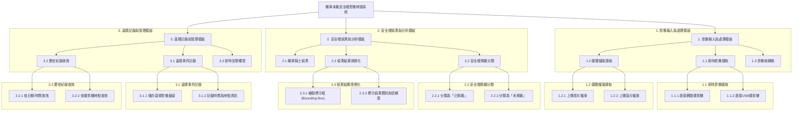

# 專題系統需求分析:校園交通違規辨識系統

## 功能性需求 (Functional Requirements)

### 1.影像來源擷取與處理功能 (Video/Image Input and Processing)
- 系統應能夠接收即時影像串流：可以連接網路攝影機（IP Camera）或USB攝影機，即時擷取校園車道或停車場的畫面。
- 系統應支援上傳影片或圖片檔案：使用者可以手動上傳預先錄製好的影片（例如.mp4, .avi格式）或單張圖片（.jpg, .png格式），系統會對這些檔案進行分析。
- 系統應能將影片自動轉換為連續影像幀：為了進行物件偵測，系統需要能設定固定的時間間隔（例如每秒擷取5幀）或自動將影片逐幀分解，以利YOLOv8模型進行後續辨識。

### 2.安全帽佩戴偵測與標示功能 (Helmet Detection and Labeling)
- 系統必須能準確辨識畫面中的機車騎士：利用YOLOv8模型，框選出影像中所有騎乘機車的人物。
- 系統必須能判斷騎士是否佩戴安全帽：對於每一個辨識出的騎士，模型需要能夠進一步分類為「有戴安全帽 (helmet)」與「未戴安全帽 (no-helmet)」兩種狀態。
- 系統應在畫面上視覺化標示結果：在即時影像或結果圖片中，用不同顏色或標籤的邊界框（Bounding Box）明確標示出未戴安全帽的騎士，例如以紅色框標示違規者，綠色框標示合規者。

### 3.違規事件記錄與告警功能 (Violation Logging and Alerting)
- 系統應自動記錄未戴安全帽事件：當偵測到違規事件時，系統需要自動儲存該畫面的截圖作為證據，並記錄下偵測到的時間、地點（如攝影機編號）等資訊。
- 系統應提供違規事件的查詢介面：使用者（例如校安人員）可以透過一個簡單的介面，依據日期、時間區間或攝影機地點來查詢歷史違規紀錄與相關影像證據。
- 系統應能產生即時告警（可選功能）：當偵測到違規時，系統可以選擇性地觸發一個告警機制，例如發送電子郵件通知給管理者，或在監控畫面上彈出警示訊息。

---

## 非功能性需求 (Non-functional Requirements)

### 1.準確性 (Accuracy)
- 模型辨識準確率要求：在測試資料集中，系統對於「未戴安全帽」的偵測準確率（Precision）應達到90%以上，以避免過多的誤判。同時，召回率（Recall）也應達到85%以上，確保不會漏掉太多實際的違規者。
- F1−Score 要求：綜合考量準確率與召回率，系統的 F1−Score 應至少達到0.88，以確保模型的穩健性。

### 2.易用性 (Usability)
- 使用者介面（UI）直觀性：系統應提供圖形化使用者介面（GUI），讓非技術背景的校安人員也能輕鬆操作，例如：只需點擊幾下按鈕即可開始偵測、觀看即時畫面及查詢歷史紀錄。
- 安裝與設定簡易性：系統的安裝部署過程應盡量簡化，並提供清晰的設定文件，讓專題的評審或未來的使用者能夠在30分鐘內完成基本環境的設定與啟動。

### 3.效能與即時性 (Performance & Real-time)
- 影像處理速度：對於即時影像串流，系統的處理速度（FPS, Frames Per Second）應至少達到10 FPS，以確保影像不會有明顯的延遲或卡頓，能夠順暢地進行即時監控。
- 系統反應時間：從偵測到違規事件到系統完成紀錄並發出告警（若有此功能）的延遲時間，應控制在2秒以內。

---



---

```mermaid

graph LR
    actor "校安人員" as U1
    actor "系統管理員" as U2

    rectangle "機車未戴安全帽影像辨識系統" {
        U1 -- UC1(監看即時影像)
        U1 -- UC2(分析上傳檔案)
        U1 -- UC3(查詢違規紀錄)
        
        UC3 -- UC4(匯出違規報表)

        U2 -- UC5(管理攝影機)
        U2 -- UC6(設定系統參數)
        U2 -- UC7(管理使用者帳號)

        UC1 ..> UC_Detect : <<include>>
        UC2 ..> UC_Detect : <<include>>
        
        UC_Detect(偵測騎士與安全帽狀態)
        
        UC_Detect ..> UC_Log : <<include>>
        UC_Log(自動記錄違規事件)

        UC_Log ..> UC_Alert : <<extend>>
        UC_Alert(發送即時告警)
    }
```


