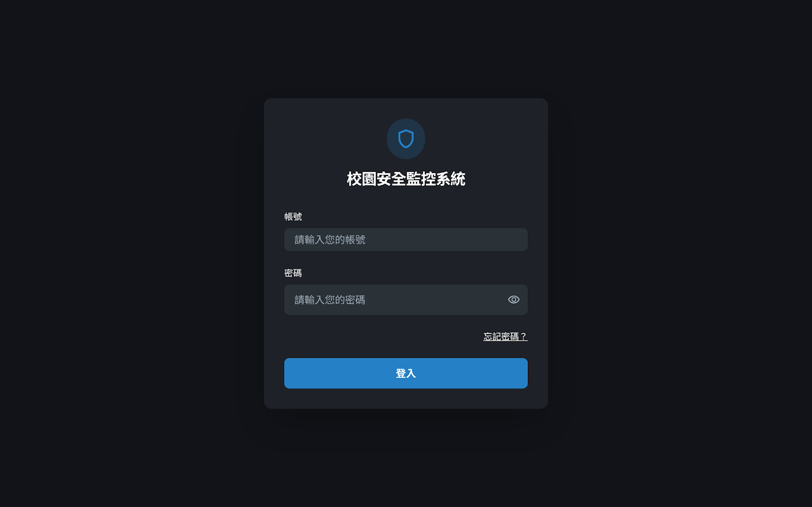
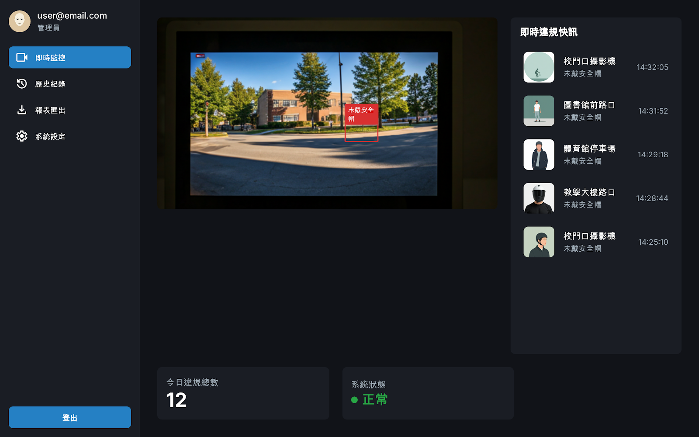
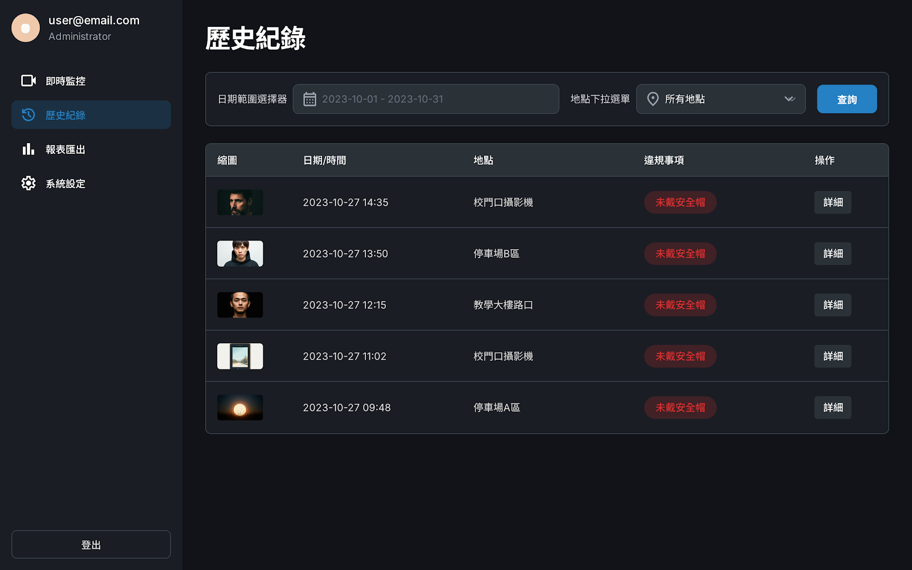
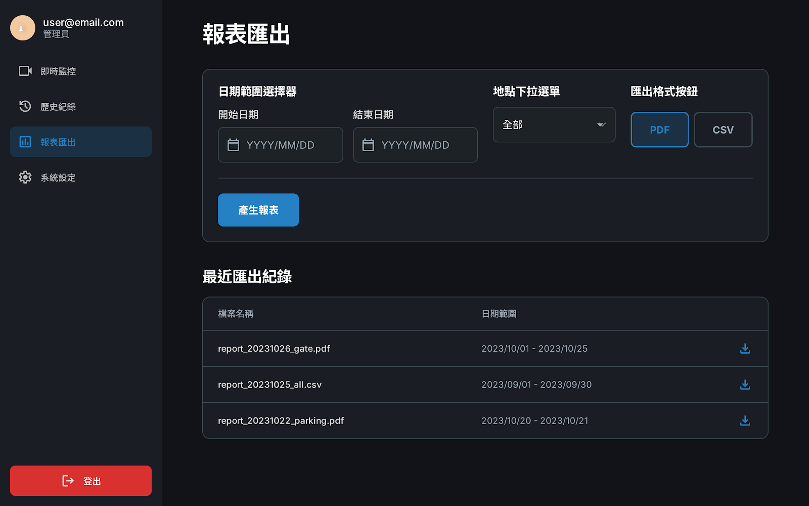
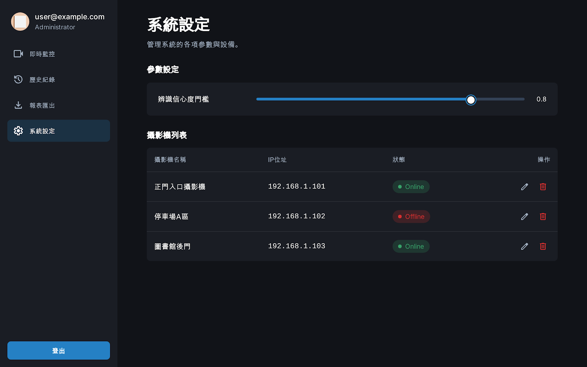

# 介面設計分鏡板 (UI Storyboard)

## 使用者登入 (Login Scene)

**1. 輸入欄位規格 (Input Specifications)**

| 欄位名稱 (Label) | 欄位識別碼 (Field ID) | 資料型態 (Data Type) | 必填 | 驗證規則 (Validation Rules) | 錯誤訊息 (Error Message) |
| :--- | :--- | :--- | :--- | :--- | :--- |
| **帳號** | `username` | String (Varchar) | 是 | 1. 不可為空 2. 長度限制 4-20 字元 3. 僅限英數字 | 請輸入有效的帳號 |
| **密碼** | `password` | String (Encrypted) | 是 | 1. 不可為空 2. 隱碼顯示 (Masked) | 請輸入密碼 |

**2. 功能按鈕與連結 (Actions)**

| 元件名稱 | 功能描述 | 觸發事件 (Event) |
| :--- | :--- | :--- |
| **登入按鈕** | 驗證帳密，成功後跳轉至「即時監控儀表板」；失敗則顯示錯誤提示。 | `onClick` -> API `/login` |
| **忘記密碼** | 跳轉至密碼重設流程或提示聯絡管理員。 | `onClick` -> Redirect |

---

## 即時監控儀表板 (Dashboard Scene)

**1. 顯示欄位與功能 (Display Fields)**

| 區塊 | 欄位名稱 | 資料來源 | 功能描述 |
| :--- | :--- | :--- | :--- |
| **導航欄** | 側邊選單 | System Config | 提供頁面切換 (即時監控、歷史紀錄、報表匯出、系統設定)。 |
| **影像區** | **即時串流** | RTSP/WebRTC | 顯示攝影機畫面，疊加 YOLOv8 繪製的紅框 (未戴安全帽)。 |
| **影像區** | 攝影機名稱 | Database | 顯示目前正在監看的攝影機位置名稱 (如：校門口攝影機)。 |
| **快訊區** | **即時違規列表** | WebSocket | 當後端偵測到違規，自動由上而下滑入新事件卡片。 |
| **快訊區** | 違規縮圖 | Image Blob | 違規瞬間的騎士裁切圖 (Avatar)。 |
| **快訊區** | 違規時間 | Timestamp | 顯示偵測到的時間 (HH:mm:ss)。 |
| **快訊區** | 違規類型 | String | 顯示違規項目 (例如：未戴安全帽)。 |
| **統計區** | **今日違規總數** | SQL Count | 顯示當日累計的違規件數 (大字體顯示)。 |
| **統計區** | 系統狀態 | Health Check | 顯示綠燈 (正常) 或紅燈 (異常/斷線)。 |

---

## 歷史紀錄查詢 (History Query Scene)

**1. 輸入/篩選欄位規格 (Filter Inputs)**

| 欄位名稱 | 欄位識別碼 | 資料型態 | 預設值 | 驗證規則 |
| :--- | :--- | :--- | :--- | :--- |
| **日期範圍** | `date_range` | Date Range | 本月 | 結束日期必須 >= 開始日期 |
| **地點選擇** | `location_id` | Dropdown (List) | 所有地點 | 必須選取清單中的項目 |
| **查詢按鈕** | `btn_search` | Button | N/A | 點擊後刷新下方列表 |

**2. 列表資料欄位 (Grid Columns)**

| 欄位名稱 | 資料型態 | 功能描述 |
| :--- | :--- | :--- |
| **縮圖** | Image | 顯示違規當下的寬景縮圖。 |
| **日期/時間** | DateTime | 格式：YYYY-MM-DD HH:mm |
| **地點** | String | 攝影機架設位置名稱。 |
| **違規事項** | Tag/String | 以紅色膠囊樣式顯示「未戴安全帽」。 |
| **操作** | Button | 「詳細」按鈕，點擊後彈出視窗顯示大圖與詳細信心度數據。 |

---

## 報表匯出 (Report Export Scene)

**1. 輸入欄位規格 (Input Specifications)**

| 欄位名稱 | 欄位識別碼 | 資料型態 | 驗證規則 |
| :--- | :--- | :--- | :--- |
| **開始日期** | `start_date` | Date Picker | 不可為空，格式 YYYY/MM/DD |
| **結束日期** | `end_date` | Date Picker | 不可為空，必須 >= 開始日期 |
| **地點** | `location` | Dropdown | 預設為「全部」 |
| **匯出格式** | `format` | Toggle Button | 必須擇一 (PDF 或 CSV) |

**2. 報表列印/下載欄位 (Report Content)**

| 報表欄位 | 說明 |
| :--- | :--- |
| **流水號** | 案件編號。 |
| **違規時間** | 精確到秒。 |
| **違規地點** | 攝影機名稱。 |
| **違規截圖** | 嵌入 PDF 的證據照片。 |
| **辨識信心度** | YOLO 模型給出的 Confidence Score (例如 0.92)。 |

**3. 最近匯出紀錄列表 (Recent History)**

| 欄位名稱 | 功能描述 |
| :--- | :--- |
| **檔案名稱** | 系統自動生成的檔名 (如 `report_20231026_gate.pdf`)。 |
| **日期範圍** | 該報表所涵蓋的資料區間。 |
| **下載圖示** | 點擊可再次下載該檔案。 |

---

## 系統設定 (System Settings Scene)

**1. 參數設定 (Parameter Inputs)**

| 欄位名稱 | 識別碼 | 元件類型 | 資料型態 | 範圍/規則 | 功能說明 |
| :--- | :--- | :--- | :--- | :--- | :--- |
| **辨識信心度門檻** | `conf_threshold` | Slider (滑桿) | Float | 0.1 ~ 1.0 | 設定 AI 判定違規的最低信心度。數值越高誤判越少，但可能漏判。 |

**2. 攝影機列表管理 (Camera Management)**

| 列表欄位 | 資料型態 | 顯示/互動邏輯 |
| :--- | :--- | :--- |
| **攝影機名稱** | String | 顯示名稱 (如：正門入口)。 |
| **IP 位址** | String | 顯示 IPv4 格式 (如 192.168.1.101)。 |
| **狀態** | Status Indicator | 綠燈(Online): Ping 成功 / 紅燈(Offline): Ping 失敗。 |
| **操作 (編輯)** | Icon Button | 點擊後將該列轉為輸入框模式，可修改名稱與 IP。 |
| **操作 (刪除)** | Icon Button | 點擊後跳出「確認刪除」對話框 (Confirm Dialog)。 |

